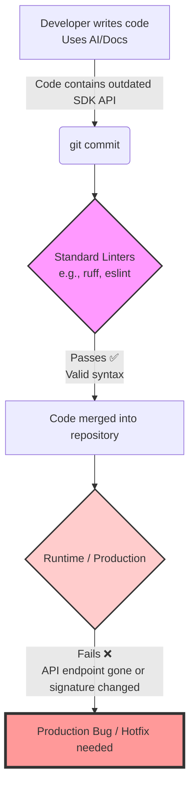
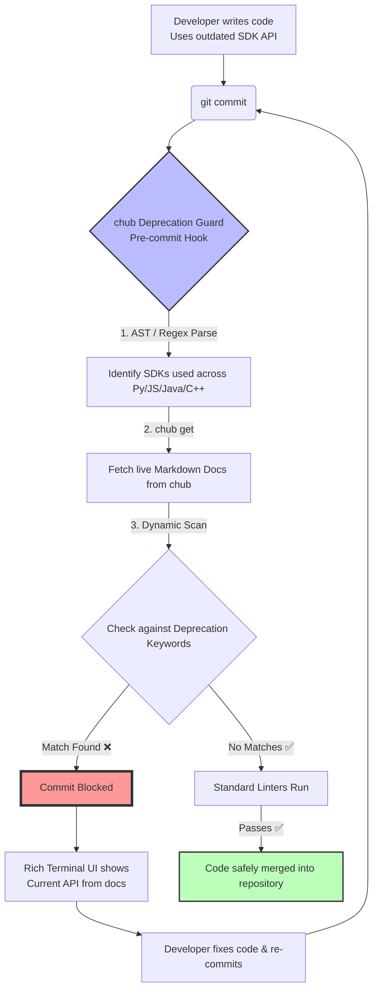

# Workflow Comparison: With vs. Without chub Deprecation Guard

This document illustrates the stark difference in the developer experience and project safety when using the **chub Deprecation Guard** versus a standard multi-language development workflow.

---

## 1. The Standard Workflow (Without the Guard)

In a standard workflow, AI agents or developers might copy/paste outdated SDK code. Standard linters (`ruff`, `eslint`, `checkstyle`) do not know about third-party API deprecations, so the bad code successfully enters the repository, leading to runtime failures or technical debt.



---

## 2. The Guarded Workflow (With chub Deprecation Guard)

With the tool installed, the workflow intercepts the deprecated code *before* it can enter the git history. It dynamically syncs with the live `chub` documentation to provide immediate, actionable feedback to the developer.

### Setup Phase
Before the workflow begins, the tool must be integrated into the repository:
1. **Initialize:** Run `npx chub-guard-init` (or `pipx run chub-guard-init`) in the root of your project. This automatically creates the pre-commit hooks and copies necessary files.
2. **Install CLI:** Run `npm install -g @aisuite/chub` to provide the documentation retrieval engine.

### Execution Flow


---

## 3. Standalone / CI Usage (Without Git Hooks)

The tool isn't restricted to `git commit`. You can run it manually at any time to audit an entire codebase, which is especially useful during CI/CD pipelines or when onboarding the tool to a massive legacy repository.

### Auditing the Entire Repository
To scan all supported files in the current repository without triggering a commit, you can use `pre-commit`'s manual run command:

```bash
# Scans every tracked file in the repository
pre-commit run chub-deprecation-guard --all-files
```

### Auditing Specific Files
If you don't want to use `pre-commit` at all, you can invoke the Python script directly. This is ideal for CI GitHub Actions or custom bash scripts:

```bash
# Scan specific files
python scripts/chub_guard.py run src/main.py src/app.js src/Backend.java

# Scan a whole directory (Linux/macOS)
python scripts/chub_guard.py run $(find src/ -name "*.py" -o -name "*.js" -o -name "*.java" -o -name "*.cpp")

# Scan a whole directory (Windows PowerShell)
python scripts/chub_guard.py run (Get-ChildItem -Path src\ -Recurse -Include *.py,*.js,*.java,*.cpp).FullName
```

### Updating the Registry (Maintenance)
You can also manually trigger the tool to search the `chub` network for newly published AI/ML SDKs and propose additions to your local registry:

```bash
python scripts/chub_guard.py update-registry
```
