# Chub Guard: Complete End-to-End System Flow

This document details the complete execution flow of the `chub-guard` system, from initial installation to daily background syncs and code-commit interception.

```mermaid
flowchart TD
    %% ─── SETUP & INITIALIZATION ───
    subgraph Setup ["1. Installation & Initialization"]
        A1["Developer installs VS Code Extension<br/>(chub-guard)"] -- Auto-Activation --> A2
        A3["Developer runs npx chub-guard-init<br/>or pipx run chub-guard-init"] --> A2
        A2["Init Tool Copies Files:<br/>scripts/chub_guard.py<br/>.chub-docs/registry.json"]
        A2 --> A4["Installs pre-commit Git Hook"]
        A4 --> A5["Developer installs doc engine:<br/>npm install -g @aisuite/chub"]
    end

    %% ─── THE 24-HOUR SYNC CYCLE ───
    subgraph Sync ["2. Community Intelligence Sync"]
        B1(("Git Commit OR IDE Save")) --> B2{"Has 24h passed since<br/>last Global Sync?"}
        B2 -- Yes --> B3["Fetch deprecations.json from<br/>rhealaloo45/chub-guard GitHub repo"]
        B3 --> B4["Merge global patterns into<br/>local historical_deprecations.json"]
        B4 --> B5["Update mtime timestamp"]
        B2 -- No --> B6["Skip Sync"]
        B5 --> B6
    end

    %% ─── DISCOVERY & PARSING ───
    subgraph Parsing ["3. Multi-Language Parsing & Resolution"]
        B6 --> C1["Read Staged Files (Hook)<br/>OR Active File (IDE)"]
        
        C1 --> C2_Py["Python ast<br/>Extract import"]
        C1 --> C2_JS["JS/TS Regex<br/>Extract require/import"]
        C1 --> C2_Java["Java Regex<br/>Extract import"]
        C1 --> C2_C["C/C++ Regex<br/>Extract #include"]
        
        C2_Py & C2_JS & C2_Java & C2_C --> C3["Normalize Import Names<br/>e.g. @angular/core -> angular/core"]
        
        C3 --> C4{"Is it a Standard Library<br/>or Unmapped Module?"}
        C4 -- Yes (Not in Global Registry) --> C5["Silently Skip<br/>Minimize Noise"]
        C4 -- No (In Global Registry) --> C6["Update Local Project<br/>registry.json"]
    end

    %% ─── DOCUMENTATION FETCHING ───
    subgraph Fetching ["4. Documentation Fetching"]
        C6 --> D1["Parse package.json & requirements.txt<br/>to find pinned package versions"]
        D1 --> D2["Run chub get pkg --version v"]
        
        D2 --> D3{"Success?"}
        D3 -- Yes --> D4["Save Markdown to<br/>.chub-docs/pkg.md"]
        D3 -- No --> D5["Fallback: Fetch raw Markdown<br/>from GitHub source URL"]
        D5 --> D4
    end

    %% ─── ANALYSIS & SCANNING ───
    subgraph Analysis ["5. Deep Code Analysis"]
        D4 --> E1["Extract deprecation patterns from Markdown<br/>Look for 'deprecated', 'legacy'"]
        E1 --> E2["Store new patterns in<br/>historical_deprecations.json"]
        
        E2 --> E3["Scan Source Code against<br/>all Historical & New Patterns"]
        
        %% Advanced AST
        C2_Py --> E4["Python Advanced AST NodeVisitor"]
        E4 --> E5["Check Structural Rules:<br/>- aiohttp outside async with<br/>- Deprecated kwargs (e.g. fp16=True)"]
        
        E3 & E5 --> E6["Compile list of Violations"]
    end

    %% ─── FILTERING & REPORTING ───
    subgraph Reporting ["6. Filtering & Reporting"]
        E6 --> F1{"Line has # noqa: CHUB<br/>or // noqa: CHUB ?"}
        F1 -- Yes --> F2["Suppress Violation"]
        F1 -- No --> F3["Categorize Violations by Language"]
        
        F3 --> F4["Run Native ruff for Python UP rules"]
        F4 --> F5["Extract exact migration code blocks<br/>from documentation"]
        
        F5 --> G1{"Trigger Source?"}
        
        G1 -- "VS Code (Real-time)" --> G2["Red Squiggles on Code Lines<br/>Side Panel Violation List<br/>Click-to-Jump Navigation"]
        G1 -- "Git Commit (Hook)" --> G3["Rich Terminal Tables<br/>Generate chub_guard_report.md"]
        
        G3 --> F8{"Any Blocking Violations?"}
        F8 -- Yes --> F9["sys.exit 1 - Commit Blocked"]
        F8 -- No --> F10["sys.exit 0 - Commit Passes"]
    end

    %% ─── COMMUNITY PROMOTION ───
    subgraph Promotion ["7. Community Pattern Promotion"]
        P1(("Manual CLI Command<br/>promote-deprecations")) --> P2["Read historical_deprecations.json"]
        P2 --> P3["Apply Quality Filters"]
        P3 --> P4["Merge valid patterns into<br/>Root deprecations.json"]
        P4 --> P5["Developer pushes to GitHub<br/>helping the global community!"]
    end

    %% Tie triggers to the main flow
    Setup --> B1
    F9 -.->|Developer Fixes Code| B1
    G2 -.->|Manual Fix| B1
    F10 -.-> P1
```

### Key System Updates
- **Hybrid Entry Points**: The system now triggers either via a `git commit` (pre-commit hook) or automatically on file save in VS Code.
- **Auto-Initialization**: The VS Code extension detects projects missing `chub-guard` and offers to run `chub-guard-init` automatically.
- **Language-Agnostic Suppressions**: Explicit support for `// noqa: CHUB` in JS/TS files alongside Python's `# noqa: CHUB`.
- **IDE Visualization**: Violations are now presented as standard VS Code diagnostics (red squiggles) and a dedicated side panel for easier navigation.

