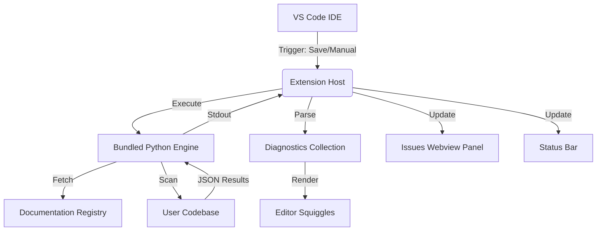
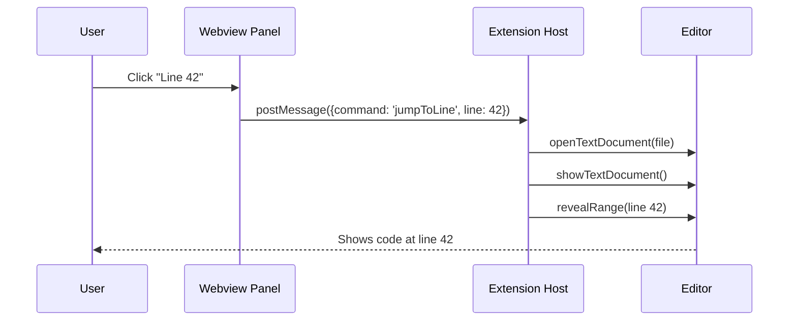

# 🛡️ VS Code Extension Flow: chub-guard

This document provides a detailed, step-by-step breakdown of how the **chub-guard** VS Code extension operates, from activation to real-time linting and issue resolution.

---

## 🏗️ High-Level Architecture

The extension acts as a bridge between the **VS Code IDE** and the **Python-based Analysis Engine**. This allows it to leverage the speed and UI of VS Code while using the deep structural analysis capabilities of the bundled Python script.

---

## 🔄 Step-by-Step Execution Flow

### 1. Activation & Initialization
When VS Code starts up (or when a supported file is opened), the extension activates:
*   **Status Bar Setup**: Creates the `🛡️ chub-guard` status bar item.
*   **Diagnostic Collection**: Initializes a persistent collection for editor "squiggles".
*   **Registry Check**: Ensures the local `.chub-docs/` registry is accessible.

### 2. Triggering a Scan
A scan can be triggered in two ways:
*   **Automatic (onSave)**: Whenever a supported file (`.py`, `.js`, `.ts`, `.java`, etc.) is saved, the extension triggers a workspace-wide scan.
*   **Manual**: Triggered via the `chub-guard: Scan Now` command or by clicking the status bar icon.

### 3. The Python Bridge (`runner.ts`)
The extension does not lint the code itself. Instead, it spawns a background process:
*   **Locate Engine**: Finds the `chub_guard.py` script bundled inside the extension folder.
*   **Spawn Process**: Runs the script using the system's Python interpreter (or the user-configured `chubGuard.pythonPath`).
*   **Command**: Executes `python chub_guard.py scan --json --root <workspace_path>`.

### 4. Hybrid Analysis Engine
Inside the Python process:
*   **AST Pass (Python)**: Builds an Abstract Syntax Tree to find high-confidence structural issues (e.g., missing context managers).
*   **Regex Pass (Polyglot)**: A resilient fallback that catches automation patterns and legacy signatures, even in files with syntax errors.
*   **Doc Sync**: Cross-references imported modules with the `chub` documentation to find deprecated APIs.

### 5. Reporting & UI Update
Once the Python process finishes and returns a JSON array:
*   **Diagnostics**: The extension parses the line and column numbers to place **red/yellow squiggles** directly in the editor.
*   **Status Bar**: Updates to show the total issue count (e.g., `$(warning) chub-guard: 5 issues`).
*   **Issues Panel**: If violations exist, the **🛡️ chub-guard Panel** (Webview) opens or updates, grouping issues by file.

---

## 🖱️ Interaction & Resolution Flow

### Jumping to Code
When you click a "Line X" link in the Issues Panel:
1.  The Webview sends a `jumpToLine` message to the Extension Host.
2.  The extension opens the target file.
3.  The cursor is moved to the specific line, and the view is centered.

### Fixing with LLM
The "Copy to fix with LLM" button streamlines the migration:
1.  The extension reads the latest `chub_guard_report.md` generated during the scan.
2.  The content is copied to the system clipboard.
3.  The user pastes this into an AI assistant (like Cursor or Copilot), which uses the structured migration hints to fix the code.

### Git Hook Management
The extension allows visual control over the `pre-commit` hook:
*   **Pause**: Temporarily renames the hook file to prevent it from running.
*   **Resume**: Restores the hook.
*   **Force Commit**: Uses a custom Git flag to bypass the guard for a single emergency commit.

---

## 🛠️ Error Handling & Resilience
*   **Python Missing**: If Python isn't found, the extension prompts the user to install it or configure the path.
*   **Syntax Errors**: If a file is broken, the engine falls back to a **Regex-only scan**, ensuring that deprecations are still caught during heavy refactoring.
*   **Network Failure**: The engine uses a local documentation cache, so real-time feedback remains active even if the user is offline.
