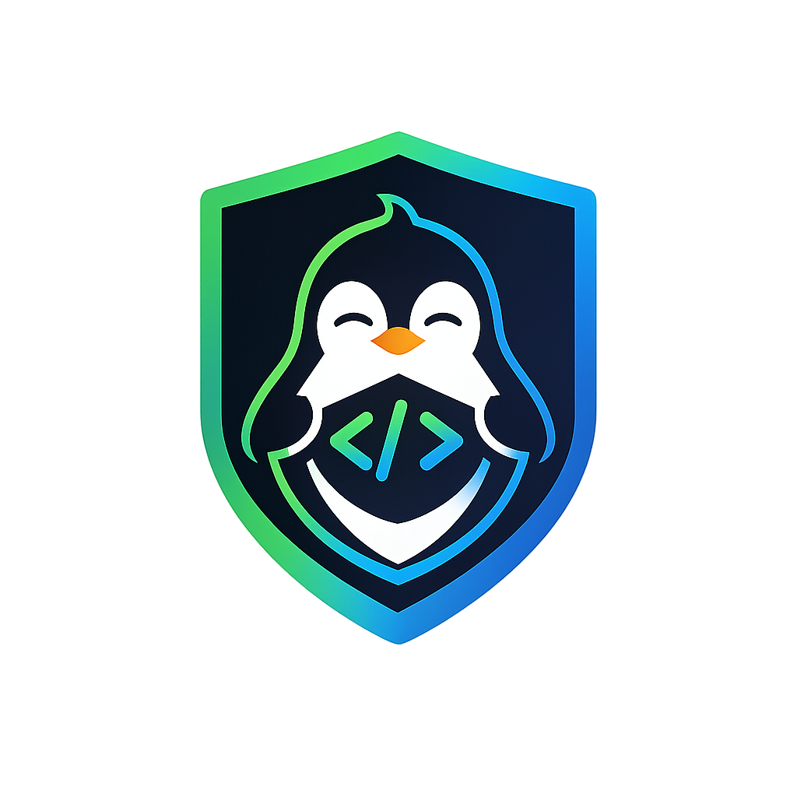

  
  <h1>🛡️ Chub Guard for VS Code</h1>
  
<b>Real-time detection of deprecated AI SDK patterns, legacy automation APIs, and outdated code.</b>

---

**Chub Guard** is a highly intelligent, zero-configuration VS Code extension that keeps your codebase modern. It actively scans your code against the **LATEST** documentation from [Context-Hub](https://github.com/andrewyng/context-hub) to flag deprecated usages of major AI libraries (OpenAI, Anthropic, Gemini, LangChain) and automation tools (Playwright, Selenium) before they break your builds.

## ✨ Why Chub Guard?

- **Zero-Effort Setup**: Works out of the box. The Python linting engine and documentation registries are **bundled directly inside the extension**. No manual `pip install` or configuration required!
- **Cross-Language**: Intelligently scans Python (`.py`), JavaScript/TypeScript (`.js`, `.ts`, `.jsx`, `.tsx`), C/C++ (`.c`, `.cpp`), and Java (`.java`).
- **Proactive Protection**: Catch deprecations *as you type*, long before they hit your CI pipeline.

## 🚀 Key Features

*   🔴 **Real-Time Editor Squiggles**: Instantly highlights deprecated code with inline diagnostics as you type or save.
*   📋 **Interactive Issues Panel**: A dedicated, collapsible side panel groups violations by file. Features severity badges (🔴 Breaking, 🟡 Warning, 🔵 Info) for quick triaging.
*   🎯 **One-Click Navigation**: Click on any issue in the panel to instantly jump to the exact file and line number.
*   🤖 **"Copy to fix with LLM"**: Instantly copies a highly structured markdown report of all violations to your clipboard. Paste it directly into ChatGPT, Claude, or GitHub Copilot Chat for automated, project-wide fixes.
*   🛠️ **Git Hook Management**: Visually monitor, pause, or resume your `chub-guard` pre-commit hooks directly from the UI. Need to push an emergency fix? Use the **Force Commit** button to bypass the hook temporarily.

## ⚙️ How it Works

1. **Install** the extension from the VS Code Marketplace.
2. Open your project. The extension will automatically scan your files on startup and on every save.
3. If deprecated patterns are found, the 🛡️ **Chub Guard Panel** will pop up, revealing where the issues are.

## ⌨️ Commands

Access these via the Command Palette (`Ctrl+Shift+P` or `Cmd+Shift+P`):

*   `chub-guard: Scan Now` — Force a manual scan of the entire workspace.
*   `chub-guard: Pause Pre-commit Hook` — Stop the Git hook from blocking commits temporarily.
*   `chub-guard: Resume Pre-commit Hook` — Re-enable the Git hook.
*   `chub-guard: Hide Panel on Save` — Suppress the panel from auto-opening on every save (diagnostics will still show up as squiggles).
*   `chub-guard: Show Panel on Save` — Re-enable auto-opening of the panel.

## 🤫 Suppressing False Positives

Sometimes you absolutely need to use a deprecated method. You can easily suppress warnings for specific lines:

*   **Python:** Add `# noqa: CHUB` to the end of the line.
*   **JS/TS/C/Java:** Add `// noqa: CHUB` to the end of the line.

## ⚙️ Configuration

You can customize the extension behavior in your VS Code settings:

*   `chubGuard.showPanelOnSave`: Automatically open the Issues Panel when violations are found on save (Default: `true`).
*   `chubGuard.pythonPath`: Specify the path to your Python executable if it's not in your system PATH (Default: `python`).

## 🔧 Requirements

*   **VS Code**: Version `1.75.0` or higher.
*   **Python**: Python 3.10+ must be installed on your system and available in your `PATH` (used internally by the bundled engine).

---
**Part of the Chub Guard Ecosystem**
*Available via **VS Code Marketplace**, **npm**, and **PyPI**.*
*For CLI usage, pre-commit hooks, and advanced global registry configurations, visit the main repository:*
👉 **[github.com/rhealaloo45/chub-guard](https://github.com/rhealaloo45/chub-guard)**
